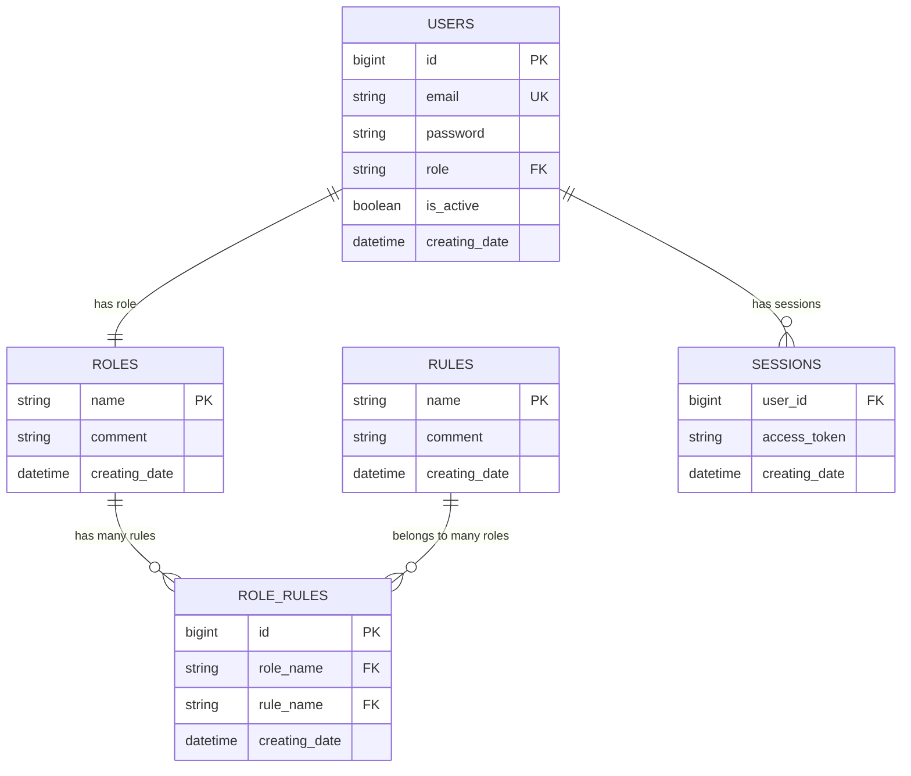
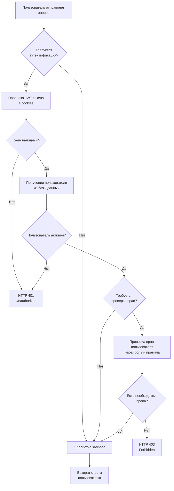

# Test Task Effective Mobile - Система аутентификации и авторизации

Это backend-приложение представляет собой собственную систему аутентификации и авторизации, разработанную как тестовое задание. Система реализует гибкую модель управления доступом к ресурсам с поддержкой пользователей, ролей и прав доступа.

## 🎯 О тестовом задании

Данный проект был разработан как тестовое задание для демонстрации навыков создания системы аутентификации и авторизации. 

**Основные требования задания:**
- Реализация собственной системы аутентификации и авторизации (не использовать готовые решения фреймворков)
- Продумывание и реализация собственной системы доступа к ресурсам
- Проектирование схемы базы данных для управления правами пользователей
- Реализация модулей взаимодействия с пользователями и разграничения прав доступа

**Цели проекта:**
- Показать понимание различий между аутентификацией и авторизацией
- Продемонстрировать работу с JWT токенами и сессиями
- Реализовать гибкую систему управления доступом к ресурсам
- Показать навыки архитектурного проектирования и работы с базами данных

## 🔥 Основные возможности

- **Аутентификация**: Регистрация, вход, выход, смена пароля, мягкое удаление аккаунта
- **Авторизация**: Система ролей и прав с гибким управлением доступом к ресурсам
- **JWT токены**: Безопасная аутентификация через HTTP cookies
- **Миграция паролей**: Поддержка миграции с SHA-256 на bcrypt
- **Панели доступа**: Административная, пользовательская и панель поддержки
- **Логирование исключений**: Комплексная система отслеживания и детального логирования ошибок

## 🏗️ Архитектура системы разграничения прав доступа

Система разграничения прав построена на основе модели RBAC (Role-Based Access Control) с дополнительной гибкостью.

### Структура базы данных

```
users (пользователи)
├── id: BigInteger - уникальный ID пользователя
├── email: String - email для входа (уникальный)
├── password: String - хешированный пароль
├── role: String - ссылка на роль пользователя
├── is_active: Boolean - статус активности аккаунта
└── creating_date: DateTime - дата создания

roles (роли)
├── name: String - уникальное имя роли (PK)
├── comment: String - описание роли
└── creating_date: DateTime - дата создания

rules (права/правила)
├── name: String - уникальное имя права (PK)
├── comment: String - описание права
└── creating_date: DateTime - дата создания

role_rules (связь ролей и прав)
├── id: BigInteger - уникальный ID связи
├── role_name: String - ссылка на роль
├── rule_name: String - ссылка на право
└── creating_date: DateTime - дата создания

sessions (сессии)
├── user_id: BigInteger - ID пользователя
├── access_token: String - JWT токен
└── creating_date: DateTime - дата создания
```

### Принципы работы системы доступа

1. **Пользователь** имеет одну **роль**
2. **Роль** может иметь множество **прав**
3. **Право** может принадлежать нескольким **ролям**
4. Доступ к endpoint'ам проверяется через middleware на основе требуемых прав
5. JWT токены хранятся в HTTP cookies и валидируются при каждом запросе

### Уровни доступа

| Роль | Права | Описание |
|------|-------|----------|
| `admin` | `admin_panel`, `support_panel`, `user_panel` | Полный доступ ко всем панелям |
| `support` | `support_panel`, `user_panel` | Доступ к панели поддержки и пользовательской панели |
| `user` | `user_panel` | Доступ только к пользовательской панели |

## 🚀 Установка и запуск

### Предварительные требования

- Python 3.8+
- PostgreSQL
- pip

### Установка зависимостей

```bash
pip install -r requirements.txt
```

### Настройка базы данных

1. **Установите и запустите PostgreSQL**
2. **Создайте базу данных**:
   ```sql
   CREATE DATABASE test_task_effective_mobile;
   ```
3. **Настройте подключение** в `database/base.py`:
   ```python
   url = URL.create(
       drivername="postgresql+asyncpg",
       username="postgres",        # ваше имя пользователя
       password="admin",           # ваш пароль
       host="localhost",
       port=5432,
       database="test_task_effective_mobile",
   )
   ```

### Запуск приложения

```bash
python main.py
```

Приложение будет доступно по адресу: `http://localhost:8000`

⚠️ **Примечание**: При первом запуске автоматически создаются таблицы базы данных и тестовые пользователи. Лог-файлы исключений сохраняются в директории `assets/exceptions/`.

## 📊 Swagger UI

После запуска приложения, документация API доступна по адресу:
**http://localhost:8000/docs**

### Как проверить функционал в Swagger

1. **Откройте Swagger UI**: Перейдите по адресу `http://localhost:8000/docs`

2. **Тестовые учетные данные** (создаются автоматически при первом запуске):
   - **Администратор**: `admin@example.com` / `admin`
   - **Поддержка**: `support@example.com` / `support`  
   - **Пользователь**: `user@example.com` / `user`

3. **Последовательность тестирования**:
   
   **Шаг 1: Аутентификация**
   - Используйте `/users/sign-in` для входа с одним из тестовых аккаунтов
   - После успешного входа JWT токен автоматически сохраняется в cookies
   
   **Шаг 2: Проверка доступа к панелям**
   - `/user-panel/` - доступен всем авторизованным пользователям
   - `/support-panel/` - доступен только ролям `support` и `admin`
   - `/admin-panel/` - доступен только роли `admin`
   
   **Шаг 3: Тестирование авторизации**
   - Войдите под пользователем с ролью `user` и попробуйте доступ к `/admin-panel/` → получите 403 Forbidden
   - Войдите под администратором и получите доступ ко всем панелям
   
   **Шаг 4: Управление ролями и правами (только для администратора)**
   - Используйте `/admin-panel/roles` для просмотра всех ролей в системе
   - Используйте `/admin-panel/rules` для просмотра всех правил доступа
   - Используйте `/admin-panel/roles-and-rules` для просмотра связей ролей и прав
   - Используйте `/admin-panel/create-role` для создания новой роли
   - Используйте `/admin-panel/create-rule` для создания нового правила
   - Используйте `/admin-panel/create-role-rule` для назначения права роли
   - Используйте `/admin-panel/delete-role` для удаления роли
   - Используйте `/admin-panel/delete-rule` для удаления правила
   - Используйте `/admin-panel/delete-role-rule` для отзыва права у роли

   **Шаг 5: Управление аккаунтом**
   - Используйте `/users/change-password` для смены пароля
   - Используйте `/users/sign-out` для выхода
   - Используйте `/users/delete-account` для мягкого удаления аккаунта

4. **Тестирование регистрации**:
   - Используйте `/users/sign-up` для создания нового пользователя
   - Новый пользователь автоматически получает роль `user`

## 📝 API Endpoints

### Управление пользователями (`/users`)

| Метод | Endpoint | Описание | Требует авторизации |
|-------|----------|----------|-------------------|
| POST | `/users/sign-up` | Регистрация нового пользователя | ❌ |
| POST | `/users/sign-in` | Вход в систему | ❌ |
| POST | `/users/sign-out` | Выход из системы | ✅ |
| POST | `/users/change-password` | Смена пароля | ✅ |
| POST | `/users/delete-account` | Удаление аккаунта | ✅ |

### Панели доступа

| Метод | Endpoint | Описание | Требуемые права |
|-------|----------|----------|----------------|
| POST | `/user-panel/` | Пользовательская панель | `user_panel` |
| POST | `/support-panel/` | Панель поддержки | `support_panel` |
| GET | `/admin-panel/` | Основная административная панель | `admin_panel` |

### Управление ролями и правами (`/admin-panel`)

| Метод | Endpoint | Описание | Требуемые права |
|-------|----------|----------|----------------|
| GET | `/admin-panel/roles` | Получить список всех ролей | `admin_panel` |
| GET | `/admin-panel/rules` | Получить список всех правил | `admin_panel` |
| GET | `/admin-panel/roles-and-rules` | Получить роли с их правами | `admin_panel` |
| POST | `/admin-panel/create-role` | Создать новую роль | `admin_panel` |
| POST | `/admin-panel/create-rule` | Создать новое правило | `admin_panel` |
| POST | `/admin-panel/create-role-rule` | Назначить право роли | `admin_panel` |
| POST | `/admin-panel/delete-role` | Удалить роль (только если нет пользователей) | `admin_panel` |
| POST | `/admin-panel/delete-rule` | Удалить правило | `admin_panel` |
| POST | `/admin-panel/delete-role-rule` | Отозвать право у роли | `admin_panel` |

## 🛡️ Безопасность

### Хеширование паролей
- Новые пароли хешируются с использованием bcrypt
- Поддерживается миграция со старых SHA-256 хешей
- Автоматическое обновление хешей при входе пользователей

### JWT токены
- Токены хранятся в HTTP-only cookies
- Автоматическое управление сессиями
- Поддержка множественных сессий с возможностью завершения

### Middleware
- Автоматическая проверка авторизации для защищенных endpoint'ов
- Проверка прав доступа на уровне маршрутов
- Обработка ошибок аутентификации (401) и авторизации (403)

## 🔧 Технологический стек

- **FastAPI** - современный веб-фреймворк для Python
- **SQLAlchemy** - ORM для работы с базой данных  
- **PostgreSQL** - реляционная база данных
- **asyncpg** - асинхронный драйвер для PostgreSQL
- **JWT** - токены для аутентификации (python-jose)
- **bcrypt** - хеширование паролей
- **Pydantic** - валидация данных
- **uvicorn** - ASGI сервер
- **aiofiles** - асинхронная работа с файлами
- **traceback-with-variables** - расширенное логирование исключений

## 📋 Примеры использования

### Регистрация пользователя

```bash
curl -X POST "http://localhost:8000/users/sign-up" \
  -H "Content-Type: application/json" \
  -d '{
    "email": "newuser@example.com",
    "password": "securepassword"
  }'
```

### Вход в систему

```bash
curl -X POST "http://localhost:8000/users/sign-in" \
  -H "Content-Type: application/json" \
  -d '{
    "email": "admin@example.com",
    "password": "admin"
  }'
```

### Доступ к административной панели

```bash
curl -X GET "http://localhost:8000/admin-panel/" \
  -H "Cookie: access_token=YOUR_JWT_TOKEN"
```

### Управление ролями и правами

**Получить список ролей:**
```bash
curl -X GET "http://localhost:8000/admin-panel/roles" \
  -H "Cookie: access_token=YOUR_JWT_TOKEN"
```

**Создать новую роль:**
```bash
curl -X POST "http://localhost:8000/admin-panel/create-role" \
  -H "Content-Type: application/json" \
  -H "Cookie: access_token=YOUR_JWT_TOKEN" \
  -d '{
    "name": "moderator",
    "comment": "Модератор контента"
  }'
```

**Создать новое правило:**
```bash
curl -X POST "http://localhost:8000/admin-panel/create-rule" \
  -H "Content-Type: application/json" \
  -H "Cookie: access_token=YOUR_JWT_TOKEN" \
  -d '{
    "name": "moderate_content",
    "comment": "Право на модерацию контента"
  }'
```

**Назначить право роли:**
```bash
curl -X POST "http://localhost:8000/admin-panel/create-role-rule" \
  -H "Content-Type: application/json" \
  -H "Cookie: access_token=YOUR_JWT_TOKEN" \
  -d '{
    "role_name": "moderator",
    "rule_name": "moderate_content"
  }'
```

## 🔍 Система логирования исключений

Приложение включает продвинутую систему мониторинга и логирования исключений для обеспечения высокого уровня отладки и мониторинга.

### Компоненты системы логирования

1. **Exception Handler** (`utils/exception_handler/handler.py`):
   - Автоматическое создание детальных логов исключений в JSON формате
   - Сохранение стандартного и расширенного трейсбека с переменными
   - Системная информация (платформа, версия Python, процессор)
   - Уникальные UUID для каждого исключения с меткой времени

2. **Exception Decorator** (`utils/exception_handler/decorator.py`):
   - Декоратор `@handle()` для автоматического перехвата и логирования исключений
   - Поддержка как синхронных, так и асинхронных функций
   - Автоматическое определение контекста (категория функции, имя)

3. **Хранение логов** (`assets/exceptions/`):
   - Автоматическое создание JSON файлов с детальной информацией об ошибках
   - Формат имени: `[UUID ДАТА_ВРЕМЯ] категория функция.json`
   - Каждый лог содержит полную трассировку с переменными всех уровней

### Пример использования

```python
from utils.exception_handler.decorator import handle

@handle("database")
async def create_user(data):
    # При возникновении исключения автоматически создастся лог
    pass

# Или прямое использование handler
from utils.exception_handler.handler import handle_async

try:
    # код
    pass
except Exception as e:
    await handle_async("category", "function", e)
```

### Структура лог-файла

```json
{
  "exception_type": "IntegrityError",
  "exception_message": "Detailed error message",
  "function_category": "database",
  "function": "create_user",
  "standard_traceback": "Standard Python traceback",
  "detailed_traceback": "Enhanced traceback with variables",
  "system_info": {
    "platform": "Windows-10-10.0.19045-SP0",
    "python_version": "3.11.0rc2",
    "processor": "Intel64 Family 6 Model 151..."
  },
  "timestamp": "2025-08-29T18:43:37.699502"
}
```

## ⚡ Особенности реализации

1. **Собственная система авторизации** - не использует готовые решения фреймворков
2. **Гибкая модель прав** - легко расширяемая система ролей и прав
3. **Мягкое удаление** - пользователи помечаются как неактивные, данные сохраняются
4. **Миграция паролей** - плавный переход на более безопасное хеширование
5. **Множественные сессии** - поддержка нескольких активных сессий пользователя
6. **Продвинутое логирование** - детальное отслеживание исключений с расширенной отладочной информацией
7. **Асинхронная архитектура** - полностью асинхронное приложение с поддержкой высокой производительности
8. **Автоматическая инициализация** - создание таблиц БД и тестовых данных при первом запуске

## 🎨 Диаграммы архитектуры

### Схема базы данных


### Поток аутентификации и авторизации


## 🚨 Известные ограничения

1. **Конфигурация БД**: Параметры подключения к PostgreSQL захардкожены в коде
2. **Секретный ключ JWT**: В продакшене следует использовать переменные окружения
3. **CORS**: Настроен для разработки (`allow_origins=["*"]`)
4. **Логи исключений**: Хранятся локально в файлах, в продакшене лучше использовать централизованное логирование

## 🔄 Возможные улучшения

1. **Переменные окружения** для конфигурации
2. **Docker контейнеризация** для упрощения развертывания
3. **Тесты** для покрытия всего функционала
4. **Валидация сложности паролей**
5. **Rate limiting** для защиты от брутфорса
6. **Refresh токены** для повышения безопасности

---

Система готова к расширению и может служить основой для реальных проектов с соответствующими доработками по безопасности и производительности.